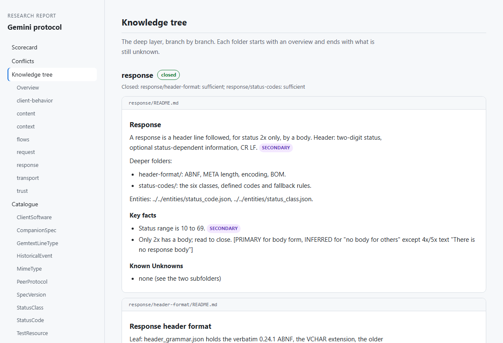

<h1 align="center">RecursiveResearch</h1>

  <strong>A Claude skill that researches a subject in depth and proves its strongest claims.</strong> 
  Packaged as a plugin for <a href="https://claude.com/claude-code">Claude Code</a>.

  
  
  
  
  

Name a subject and say what you need it for. Claude plans the research, sends
out teams of agents, and leaves you a structured knowledge base in your
project folder, with a report you can open in a browser.

Every claim says how well it is supported. Every top-tier claim carries the
exact words it rests on and where they are, and a script opens that page and
checks the words are there.

## Install

You need [Claude Code](https://claude.com/claude-code) with web search, and
Python 3.9 or later. There is nothing else to install.

**1. Add this repository as a plugin source.** Inside Claude Code:

    /plugin marketplace add rankinbc/RecursiveResearch

**2. Install the plugin:**

    /plugin install recursive-research@recursive-research

**3. Run it**, in any project folder:

    /recursive-research:recursive-research

Then tell it what to research and why:

> Research the Gemini protocol. I want to be able to write a client from the
> result.

That is all. More on installing, updating and removing it is
[further down](#installing-in-more-detail).

## How it works

  <picture>
    <source media="(prefers-color-scheme: dark)" srcset="docs/images/flow-dark.svg">
    
  </picture>

| Stage | What happens | What you get |
|---|---|---|
| **Plan** | Claude asks a few questions and drafts a research plan for your subject. **You approve it.** | `plan.json` |
| **1. Survey** | One researcher per topic, in parallel, writes a broad overview. | `knowledge/spec.md` |
| **2. Schema** | Claude identifies the kinds of thing your subject has many of. **You approve the list.** | `knowledge/entities.json` |
| **3. Catalogue** | One researcher per kind lists every instance, with a tier on every value. | `knowledge/entities/*.json` |
| **4. Deepening** | Rounds of targeted research, each resolving specific unknowns and proposing the next. **You approve each round.** | `knowledge/tree/` |

## What you get

  <picture>
    <source media="(prefers-color-scheme: dark)" srcset="docs/images/report-dark.png">
    
  </picture>

<em>The report for a real run on the Gemini protocol. One HTML file, no external resources.</em>

- **A report you can read and share.** A scorecard, every conflict, the tree
  branch by branch, and the catalogue as tables. It works offline and follows
  your light or dark theme.
- **A knowledge base on disk.** Markdown and JSON in your project folder,
  organized from overview down to exact values, formulas and algorithms.
- **A catalogue.** Every instance of every kind of thing your subject has:
  each status code, each message type, each product, each enemy.
- **A list of what is still unknown,** and why each line of research stopped.

## Why it is different

Asking a model to "research X" gives you one long answer you have to take on
trust. This gives you something you can build on.

**It goes where the gaps are.** Each round ends by listing the specific facts
still missing. Those become the next round's tasks, so effort follows the
unknowns instead of being spread evenly.

**It knows when to stop.** Every branch closes on its own when there is
nothing left to find, nothing findable, or nothing that matters for your goal.
You do not pay for research that has run dry.

**Every claim is graded.** Six tiers, from `PRIMARY` down to `UNKNOWN`. A
missing value is recorded as missing rather than guessed.

**Top-tier claims are proven.** `PRIMARY` is not a label a researcher can
hand out. The claim has to carry the exact words and the page they are on,
and a script fetches that page and looks for them. See
[what "verified" means](#what-verified-means).

**You control the cost.** You approve the plan, the catalogue list, and each
round of deeper research. Each approval tells you how many agents it will run.

**It survives interruption.** Everything is on disk. Close the session and
pick up later, and watch progress live from another terminal.

**Two kinds of agent, kept apart.** Researchers search, read and report. They
never touch the knowledge base. Organizers file what was found, remove
duplicates and settle conflicts. They have no search tools: their job is to
file, not to add.

## What "verified" means

A `PRIMARY` claim carries its evidence with it:

    The frame limit is 16384 bytes [PRIMARY: "A frame MUST NOT exceed 16384 bytes." https://example.org/spec].

The script opens that address itself and looks for those words. For a number
in the catalogue it also checks that the number is in the quote.

| Result | What happens |
|---|---|
| The words are on the page | The claim stays `PRIMARY`, is shown as `PRIMARY ✓`, and links to its source |
| No quote was given | Downgraded to `SECONDARY` |
| The words are not on the page | Downgraded to `SECONDARY`, with the reason recorded |
| The page cannot be opened | Downgraded to `SECONDARY`, with the reason recorded |

This matters because web tools hand a model a summary of a page, not the page.
A researcher can sincerely "quote" a sentence that was never there. On the
first research round this was tried on, the script confirmed 22 of 26
top-tier quotes and downgraded the other 4.

The check runs every time something is added to the knowledge base, across
the survey, the catalogue and the tree. So every `PRIMARY` in it has been
confirmed.

| Tier | Meaning |
|---|---|
| `PRIMARY` | The thing itself: source code, the original document, raw data. Checked by script |
| `EXPERT` | Verified by practitioners with direct access |
| `SECONDARY` | Published guides, references, wikis |
| `INFERRED` | Derived from other tagged facts |
| `OBSERVED` | Seen but not confirmed |
| `UNKNOWN` | Needed but not found |

When two sources disagree, the stronger tier wins. When they are equal, both
are kept and the line is marked `CONFLICT` for you to decide.

## The deepening loop

This is the part that gives the plugin its name, shown in the lower half of
the diagram. Each researcher finishes with a verdict:

| Verdict | Meaning |
|---|---|
| `exhausted` | The question is answered and nothing new is worth asking. |
| `irreducible` | Something is still unknown, but the sources do not hold the answer. |
| `sufficient` | Something is still unknown, but it does not matter for your goal. |
| `continue` | A specific further fact is findable. It must be named. |

"Research this further" is rejected. A follow-up has to name one concrete
missing fact and where it might be found.

A branch closes on its own when:

- its researchers report nothing left to find, nothing findable, or nothing
  that matters for your goal;
- a round added fewer than 3 new facts and resolved no unknowns;
- more than 60% of a round's findings were duplicates;
- a round resolved nothing and more than 80% of its findings were inferred or
  observed;
- it reaches the depth you set.

Each approval point lists what closed and why, and you can reopen any branch.

## An example

Asked to research the Gemini protocol well enough to write a client, it
produced:

| | |
|---|---|
| Survey | 15 sections |
| Catalogue | 126 instances across 11 kinds of thing |
| Knowledge tree | 8 branches, with 18 proposals for deeper work |
| One round of deepening | 4 researchers, 65 findings: 33 new, 30 set aside as duplicates |
| Disputes | 2 left over from the survey, settled by tier |

The full account is in [`docs/end-to-end-run.md`](docs/end-to-end-run.md).

## Everyday use

Here `rr.py` stands for `python /path/to/RecursiveResearch/scripts/rr.py`. Run
these from the folder that holds your `research` folder. Claude runs them for
you during a session; they are also there for you to use directly.

**Resume, or see where a project stands.** Run the skill again:

    /recursive-research:recursive-research

**Open the report:**

    rr.py --root research report <subject>

This writes `research/<subject>/report.html`. Claude offers it at each
approval point and writes it at the end.

**Watch a run live**, from a second terminal:

    rr.py --root research progress <subject> --watch

    Gemini protocol  (research/gemini-protocol)
    Next: Dispatch the next batch of tasks in 2026-10-05_deepening_w01 (next-task).

    Stages
      done         survey               16/16
      done         entity_schema        1/1
      done         entity_enumeration   11/11
      in progress  deepening            3/5

    Current session: 2026-10-05_deepening_w01
      done     frame-max-length         Find the maximum frame length  (irreducible)
      done     status-codes             Wording for each status code  (continue)
      running  tls-requirements         TLS version and SNI requirements
      blocked  redirect-limit           The redirect counting rule  -- search timed out

    Knowledge
      claims 412   verified 96   expert 14   secondary 180   inferred 61   observed 22
      open unknowns 37   conflicts 4

*(An illustration of the layout.)*

**See the numbers:**

    rr.py --root research scorecard <subject>

**Control depth and cost.** Ask for these when you approve the plan, or set
them in `plan.json`:

| Setting | Default | Meaning |
|---|---|---|
| `depth_cap` | 4 | No branch goes deeper than this many rounds |
| `max_agents_per_wave` | 4 | Agents running at once |
| `close_thresholds` | 3 / 0.6 / 0.8 | When a branch counts as run dry |

Each approval point is also a safe place to start a fresh session, which keeps
long runs cheap.

## What is on disk

    research/<subject>/
      report.html                everything below as one page, with a scorecard
      plan.json                  the approved plan
      knowledge/
        spec.md                  the survey: a readable overview
        entities.json            what kinds of thing exist
        entities/                every instance of each kind
        tree/                    the deep knowledge, branch by branch
        remaining_unknowns.md    what was not found, and why

The tree goes from overview to exact detail. Each folder has a README that
summarizes its level, links deeper, and ends with a checklist of what is still
unknown. The leaves hold exact values, formulas and algorithms.

## Installing in more detail

**Requirements**

- [Claude Code](https://claude.com/claude-code), with web search available.
  The catalogue and deepening stages refuse to run without it.
- Python 3.9 or later on your PATH, as `python3` or `python`. The plugin uses
  only the standard library.

**From Claude Code** (shown above):

    /plugin marketplace add rankinbc/RecursiveResearch
    /plugin install recursive-research@recursive-research

**From a terminal**, the same thing:

    claude plugin marketplace add rankinbc/RecursiveResearch
    claude plugin install recursive-research@recursive-research

**Check it installed:**

    claude plugin list

You should see `recursive-research`. In a new Claude Code session, typing
`/recursive` should offer `/recursive-research:recursive-research`.

**Update to the latest version:**

    claude plugin marketplace update recursive-research
    claude plugin update recursive-research@recursive-research

Then start a new Claude Code session, which is when the update takes effect.

**Remove it:**

    claude plugin uninstall recursive-research@recursive-research
    claude plugin marketplace remove recursive-research

Removing the plugin does not touch any `research` folders it created.

**Try it without installing**, from a clone of this repository:

    git clone https://github.com/rankinbc/RecursiveResearch
    claude --plugin-dir RecursiveResearch

**If something goes wrong**

| Symptom | Fix |
|---|---|
| The skill says it cannot find Python | Install Python 3.9 or later and make sure `python3` or `python` runs in your terminal |
| A stage stops with `SEARCH_UNAVAILABLE` | Web search is off or blocked in this session. Enable it and run the skill again; it resumes where it stopped |
| The command is not offered after installing | Start a new Claude Code session. Plugins load at startup |

## What is in the repository

This is a skill, not a standalone program. It runs inside Claude Code, which
supplies the model, the agents and the web search.

| Path | What it is |
|---|---|
| `skills/recursive-research/` | The skill: the coordinator's instructions, one reference per stage, and the briefs agents receive |
| `agents/` | The researcher and organizer definitions |
| `scripts/rr.py` | The script that keeps the state, checks the quotes and writes the report |
| `tests/` | The script's test suite |
| `docs/` | The design, the first end-to-end run, and the pressure tests |

## Development

    python -m unittest discover -s tests

The tests run on Windows, macOS and Linux, on Python 3.9 and 3.13, on every
push.

- Design: [`docs/specs/2026-10-04-recursive-research-design.md`](docs/specs/2026-10-04-recursive-research-design.md)
- First real run: [`docs/end-to-end-run.md`](docs/end-to-end-run.md)
- Pressure tests: [`docs/pressure-tests.md`](docs/pressure-tests.md)

## License

MIT. See [`LICENSE`](LICENSE).
